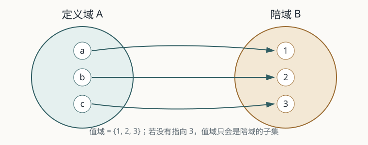

# 映射与函数：从“公式”到“对应关系”

> 对应同济《高等数学》第八版上册第一章第一节（“一、映射；二、函数”）。

## 1. 历史来源：这个概念是怎么来的？

### 从变化关系到函数

古代数学已经计算过许多今天可以写成函数的关系，例如天文学中的弦表和几何中的比例，但不能因此说古人已经拥有今天的“函数”概念。把函数当作一个独立数学对象，是在研究运动、曲线和变化量的过程中逐步形成的。

17 世纪，笛卡尔把代数表达式和几何曲线联系起来；莱布尼茨在 1673 年左右使用了 *function* 一词，约翰·伯努利在 1694 年把函数描述成由变量和常量以某种方式形成的量。欧拉在 1748 年的分析学教材中让函数成为分析的中心，但当时的函数仍常常意味着一个解析表达式。

19 世纪的傅里叶级数把问题推得更远：热传导问题需要处理分段给出、甚至不能用一个熟悉公式写出的依赖关系。柯西、傅里叶和狄利克雷的工作逐渐把“函数”从公式中解放出来。狄利克雷在 1837 年给出的思想是：给定自变量一个允许的值，就有一个规则确定唯一的函数值；规则可以不是同一个解析公式。于是“输入—唯一输出”比“写出一个公式”更基本。

到了 19 世纪后期，康托尔、戴德金等人用集合和对应关系处理无限集合的大小。戴德金在 1887 年把任意集合之间的对应关系纳入函数观念，现代教材中的“映射”因此不再局限于数到数。

> 历史边界：把古代的数表直接称为“函数”是现代人的回看。这里区分“出现了某种函数关系”和“人们明确意识到函数是一个抽象对象”。

## 2. 原始动机：数学家当时遇到了什么麻烦？

如果把函数等同于一个公式，会出现至少三个断点：

1. **很多依赖关系没有方便的公式。** 例如实验测得的温度—时间数据、分段规则和由算法给出的输出，仍然可能是确定的函数。
2. **同一公式在不同范围内是不同对象。** `sin x` 从 `R` 到 `[-1,1]` 是满射；从 `R` 到 `R` 仍是函数，却不是满射。只看公式无法说明研究对象究竟是什么。
3. **无限集合的“大小”需要一种配对语言。** 要说自然数和偶数“同样多”，不能靠数到最后一个元素；需要问能否把两个集合的元素一一配对。

因此需要把函数拆成三个部分来观察：允许哪些输入（定义域），输出被放在哪个集合中（陪域），以及每个输入究竟对应哪个输出（对应规则）。

## 3. 现代定义（同济教材精简版）

设 `A`、`B` 为非空集合。若对每个 `x ∈ A`，按照某个对应规则，都有唯一的 `y ∈ B` 与之对应，就得到从 `A` 到 `B` 的映射，记作 `f: A → B`。

- **单射**：不同的输入不会得到同一个输出，即 `f(x₁) = f(x₂)` 能推出 `x₁ = x₂`。
- **满射**：陪域 `B` 中每个元素都至少有一个原像。
- **双射**：既是单射又是满射。

在现代集合论语言里，函数也可以由有序对的集合表示；其图像记录了所有 `(x, f(x))`。初等微积分中最重要的约束是：定义域中的每一个输入必须有且只有一个输出。

## 4. 定义设计的取舍与深层意义

### “唯一”是函数的硬约束

关系 `x² + y² = 1` 本身不是从 `x` 到 `y` 的函数：当 `x = 0` 时，`y` 有两个可能值 `1` 和 `-1`。如果限制到上半圆，才得到一个函数。函数不是“任意关系”，而是对每个合法输入做出唯一承诺的关系。

### 陪域不是值域

值域是实际产生的输出集合，陪域是定义时承诺输出所处的目标集合。对 `f: R → R`、`f(x)=x²`，值域是 `[0,+∞)`，陪域却是 `R`，所以它不是满射。若改写成 `f: R → [0,+∞)`，同一个公式就变成满射。这个差别不是文字游戏：逆映射是否存在、两个集合是否等势，都要依赖它。

### 抽象化带来的收益与代价

把函数看成映射，收益是可以统一处理数据表、几何变换、算法、向量和算子；代价是必须显式管理定义域、陪域、值域，不能只凭图像或公式猜对象。抽象化不是把细节删掉，而是把真正影响结论的细节留下来。

## 5. 用处：理论内部 + 现实应用

### 理论内部

- 复合函数就是映射的连续连接：`A → B → C` 可以组成 `A → C`。
- 只有双射才有定义在整个陪域上的逆映射；这为反函数、坐标变换和变量代换提供语言。
- 极限、连续、导数和积分都研究“函数”这一对象；多元函数只是把定义域换成平面或空间中的集合。
- 单射和满射把“可逆性”和“覆盖目标空间”拆成两个独立问题，后续线性代数中的秩、核与线性变换也沿用这套思想。

### 现实应用

- **数据与程序**：哈希表、编码、传感器标定都在描述输入到输出的规则；若一个输入可能对应两个输出，系统就无法确定行为。
- **工程模型**：把时间映到温度、载荷映到位移时，定义域和陪域记录了设备的工作范围与允许输出范围。
- **几何与计算机图形学**：旋转、投影、纹理坐标都是点集之间的映射；是否可逆决定了能否无损恢复原数据。

## 6. 典型误区

1. **把表达式当成函数本身。** `x²` 作为 `R → R` 和作为 `[0,+∞) → [0,+∞)` 不是同一个映射。
2. **把值域当成陪域。** 值域是算出来的；陪域是定义时指定的。
3. **看到“能反解”就以为有逆函数。** `x²` 在整个实数上不能单射；限制定义域到 `[0,+∞)` 后才有反函数。
4. **以为函数必须连续或必须有公式。** 狄利克雷函数 `1_Q` 在每一点都不连续，但它仍满足“每个输入唯一输出”；查表和算法也不要求解析表达式。
5. **把一一对应理解成“图上看起来差不多”。** 双射是严格的存在性条件，必须说明单射和满射，而不是凭图形直觉判断。

## 7. 配套思考题 / 课堂作业

1. 设 `f(x)=sin x`。分别讨论 `f: R → [-1,1]` 与 `f: R → R` 的单射性、满射性和双射性。哪些结论改变了？原因是什么？
2. 判断关系 `x²+y²=1` 在下列限制下是否定义了从定义域到陪域的函数，并说明理由：
   - `[-1,1] → [-1,1]`；
   - `[-1,1] → [0,1]`，只取上半圆；
   - `[0,1] → [0,1]`，只取第一象限。
3. 构造一个从自然数集 `N` 到偶数集 `2N` 的双射，并解释这如何表达“两个无限集合一样多”。
4. 给定 `f: A → B` 和 `g: B → C`。用箭头图说明：若 `g∘f` 是单射，能否推出 `f` 单射？若 `g∘f` 是满射，能否推出 `g` 满射？写出证明或反例。
5. 写一段不超过 150 字的说明：为什么“函数是一个三元组（定义域、陪域、对应规则）”比“函数就是一个公式”更适合后面的微积分？

## 参考资料

- 同济大学数学科学学院：《高等数学》第八版上册，第一章第一节。出版社目录与书目信息：[高等数学第八版上册](https://xuanshu.hep.com.cn/front/book/findBookDetails?bookId=62cdab46938b7cc2960eedb1)。
- MacTutor History of Mathematics Project, “The function concept”：介绍函数概念从几何、运动和解析表达式走向一般对应关系的过程：[Function concept](https://mathshistory.st-andrews.ac.uk/HistTopics/Functions/)。
- Encyclopedia of Mathematics, “Function”：给出函数的集合论表述，并概述 Bernoulli、Euler、Dirichlet、Dedekind 等人的作用：[Function](https://encyclopediaofmath.org/wiki/Function)。
- Stanford Encyclopedia of Philosophy, “The Early Development of Set Theory”：讨论 Cantor、Dedekind 与集合、映射和无限基数的历史背景：[The Early Development of Set Theory](https://plato.stanford.edu/entries/settheory-early/)。
